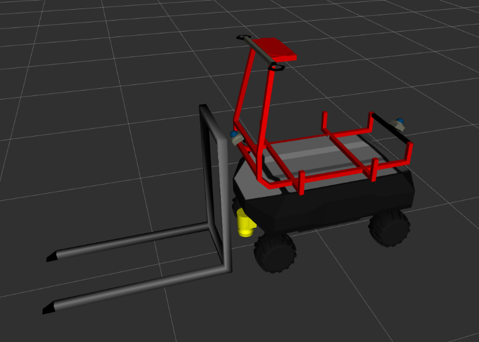
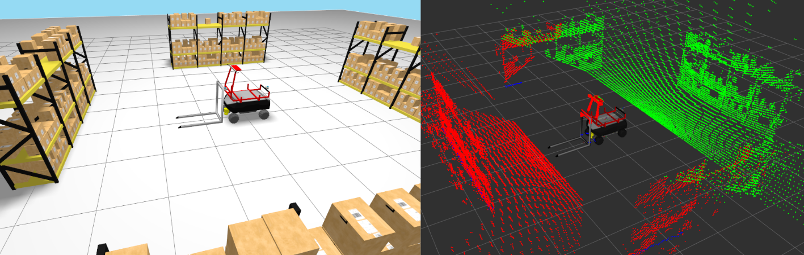

# robot_rbvogui_forklift

`robot_rbvogui_forklift` is an RB-VOGUI robot model with a fork and sensors. Start with the [robot_rbvogui_common README](../robot_rbvogui_common/README.md). It explains the mobile base and shared resources used here. This package adds the fork and sensor layout to that base.



## Resources

### Forklift model `urdf/model_forklift.xacro`

[`model_forklift.xacro`](urdf/model_forklift.xacro) is the Xacro entry point for the complete forklift model. It includes `robot_rbvogui_common/urdf/common.xacro` and adds the basket, fork, two Livox Mid-360 3D lidars, and a front-bottom 2D lidar.

This package provides its own default configuration files. They are examples and guides that you can copy and adapt when creating another forklift variant.

- [`config/default_xacro_args.yaml`](config/default_xacro_args.yaml) provides Xacro arguments for the common base, the fork, and the sensors. It includes fork limits and sensor model options.
- [`config/default_simulation.yaml`](config/default_simulation.yaml) provides settings for the common base plugins, the fork controller, and the sensor plugins.
- [`config/default_bridge.yaml`](config/default_bridge.yaml) defines the ROS 2 and Gazebo topics used by the base, the fork, and the sensors.
- [`config/default_params.yaml`](config/default_params.yaml) configures the nodes launched for the model, including the bridge, kinematics, and fork control.

### Reused resources from `robot_rbvogui_common`

The forklift model reuses the following resources from `robot_rbvogui_common`.

- The mobile base defined by `urdf/common.xacro`, including its chassis, battery, wheels, frames, and common Gazebo plugins.
- Common meshes, including the base meshes and the basket meshes used by this model.
- `launch/render_robot_urdf.launch.py`, which renders the forklift Xacro into a URDF file.
- `launch/robot_state_publisher.launch.py`, `launch/bridge.launch.py`, and `launch/ground_vehicle_kinematics.launch.py`, which start the shared model nodes.
- `worlds/debug_world.sdf` and `worlds/debug_world_bridge.yaml`, which provide the simple Gazebo world used for inspection.

The forklift package provides its own RViz configuration because its sensors differ from the base model and from other RB-VOGUI variants.

## Installation

`robot_rbvogui_forklift` depends on ROS 2 packages available from the APT package repositories. Install those dependencies with `rosdep`. It also depends on packages that are not available from APT. Their source repositories are listed in [`deps.repos`](deps.repos), including `robot_rbvogui_common`.

```bash
export WORKSPACE=<path-to-your-workspace>
mkdir -p "${WORKSPACE}"
git clone https://github.com/jfrascon/robot_rbvogui_forklift.git "${WORKSPACE}/robot_rbvogui_forklift"
vcs import "${WORKSPACE}" < "${WORKSPACE}/robot_rbvogui_forklift/deps.repos"
source /opt/ros/jazzy/setup.bash
rosdep install --from-paths "${WORKSPACE}" --ignore-src -r -y
```

## Build

Build the common package and the forklift package from the workspace root.

```bash
cd "${WORKSPACE}"
colcon build --merge-install --packages-select robot_rbvogui_common robot_rbvogui_forklift
source install/setup.bash
```

## Visualize the forklift model

The package includes a launch file and supporting resources to visualize the forklift in Gazebo and RViz without adding it to a project. This visualization is illustrative only. It runs the forklift in the shared simple test world so that you can inspect the model and receive test data from the configured sensors.

The debug launch file is useful for quickly checking that the model still works after a change and for testing changes to the fork or sensors.

```bash
robot_rbvogui_forklift_share="$(ros2 pkg prefix robot_rbvogui_forklift)/share/robot_rbvogui_forklift"
"${robot_rbvogui_forklift_share}/scripts/debug_model_forklift.sh"
```

You can pass the script any argument accepted by `debug_model_forklift.launch.py`. To see the available arguments, run:

```bash
ros2 launch robot_rbvogui_forklift debug_model_forklift.launch.py --show-args
```

For example, run the simulation without the Gazebo GUI or RViz:

```bash
robot_rbvogui_forklift_share="$(ros2 pkg prefix robot_rbvogui_forklift)/share/robot_rbvogui_forklift"
"${robot_rbvogui_forklift_share}/scripts/debug_model_forklift.sh" \
  rviz_enabled:=False \
  gzgui_enabled:=False
```



> This image shows the forklift model simulation with the default values.

## Tests

Build and run the common and forklift package tests from the workspace root.

```bash
cd "${WORKSPACE}"
colcon build --merge-install --packages-select robot_rbvogui_common robot_rbvogui_forklift
colcon test --merge-install --packages-select robot_rbvogui_common robot_rbvogui_forklift
colcon test-result --test-result-base build --verbose
```

### Inspect the generated URDF

You can also render the forklift model and validate the resulting URDF directly with `check_urdf`.

```bash
robot_rbvogui_forklift_share="$(ros2 pkg prefix robot_rbvogui_forklift)/share/robot_rbvogui_forklift"
ros2 launch robot_rbvogui_common render_robot_urdf.launch.py \
  robot_name:=rbv0 \
  robot_xacro_file:="${robot_rbvogui_forklift_share}/urdf/model_forklift.xacro" \
  robot_xacro_args_file:="${robot_rbvogui_forklift_share}/config/default_xacro_args.yaml" \
  robot_sim_file:="${robot_rbvogui_forklift_share}/config/default_simulation.yaml" \
  robot_urdf_file:=/tmp/rbvogui_forklift.urdf
check_urdf /tmp/rbvogui_forklift.urdf
```

## Parent model

This package builds on [robot_rbvogui_common](https://github.com/jfrascon/ros2_launch_helpers.git).
